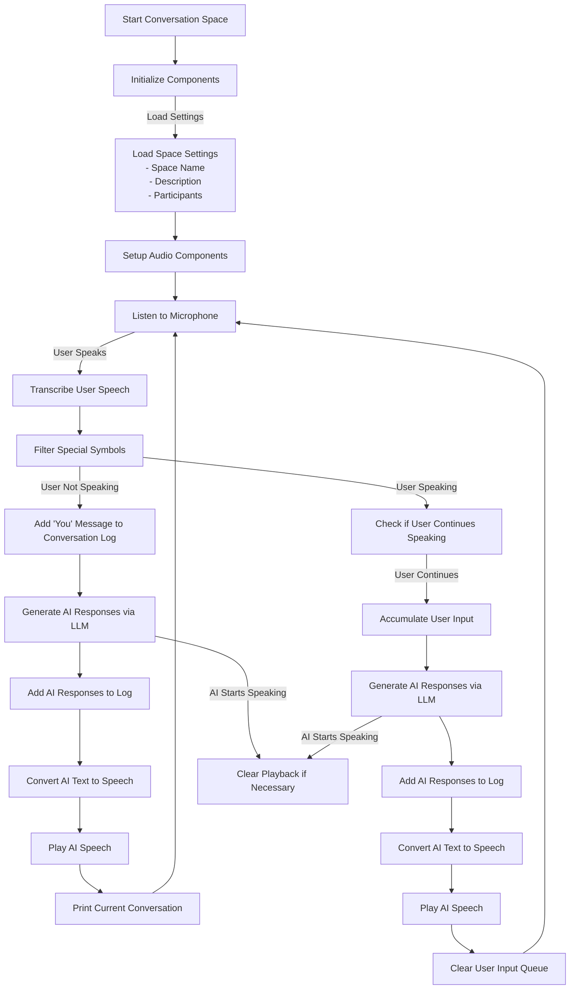

```mermaid
flowchart TD
    Start[Start Conversation Space] --> Initialize[Initialize Components]
    Initialize --> |Load Settings| Settings["Load Space Settings<br/>- Space Name<br/>- Description<br/>- Participants"]
    Settings --> SetupAudio[Setup Audio Components]
    SetupAudio --> Listen["Listen to Microphone"]
    
    Listen -->|User Speaks| Transcribe["Transcribe User Speech"]
    Transcribe --> Filter["Filter Special Symbols"]
    Filter --> |User Not Speaking| AddToLog1["Add 'You' Message to Conversation Log"]
    AddToLog1 --> GenerateResponse1["Generate AI Responses via LLM"]
    GenerateResponse1 --> AddAIResponses1["Add AI Responses to Log"]
    AddAIResponses1 --> ConvertToSpeech1["Convert AI Text to Speech"]
    ConvertToSpeech1 --> PlaySpeech1["Play AI Speech"]
    PlaySpeech1 --> PrintLog1["Print Current Conversation"]
    PrintLog1 --> Listen
    
    Filter --> |User Speaking| CheckSpeaking["Check if User Continues Speaking"]
    CheckSpeaking --> |User Continues| AccumulateInput["Accumulate User Input"]
    AccumulateInput --> GenerateResponse2["Generate AI Responses via LLM"]
    GenerateResponse2 --> AddAIResponses2["Add AI Responses to Log"]
    AddAIResponses2 --> ConvertToSpeech2["Convert AI Text to Speech"]
    ConvertToSpeech2 --> PlaySpeech2["Play AI Speech"]
    PlaySpeech2 --> ClearInput["Clear User Input Queue"]
    ClearInput --> Listen
    
    GenerateResponse1 --> |AI Starts Speaking| ClearPlayback["Clear Playback if Necessary"]
    GenerateResponse2 --> |AI Starts Speaking| ClearPlayback
```